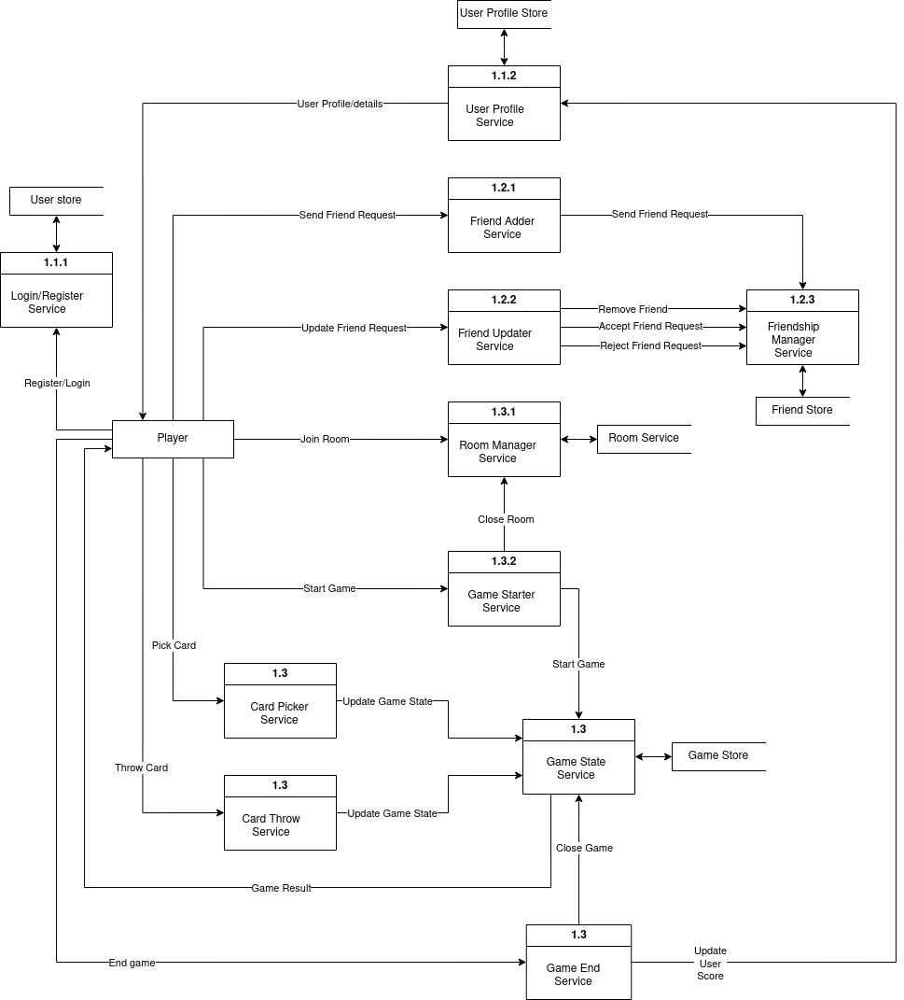
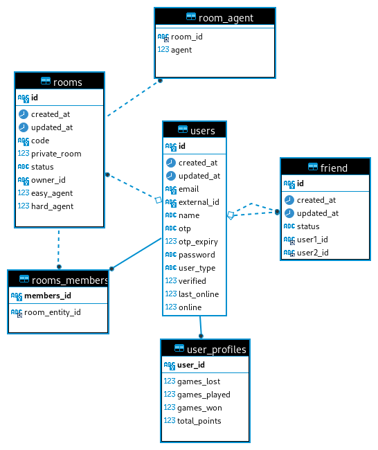
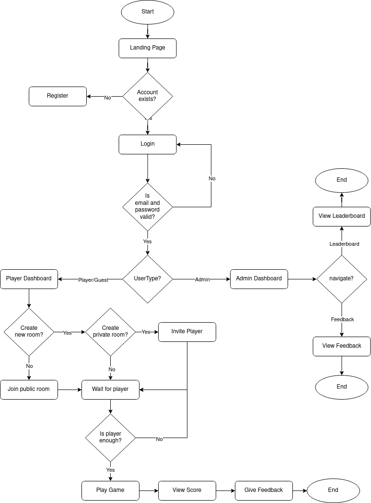
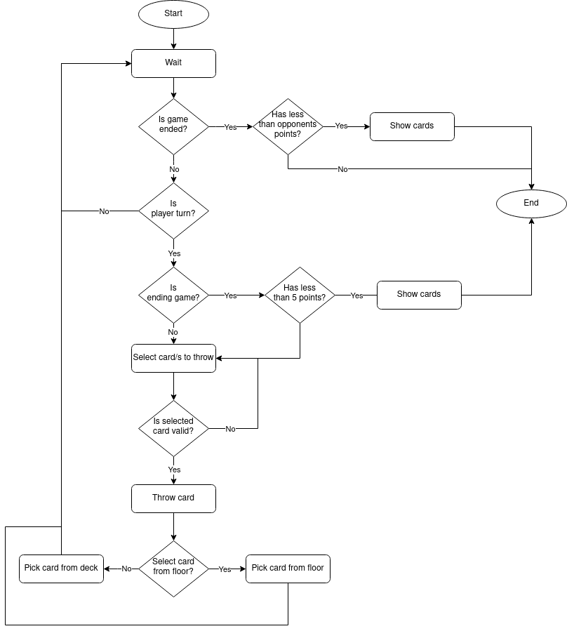
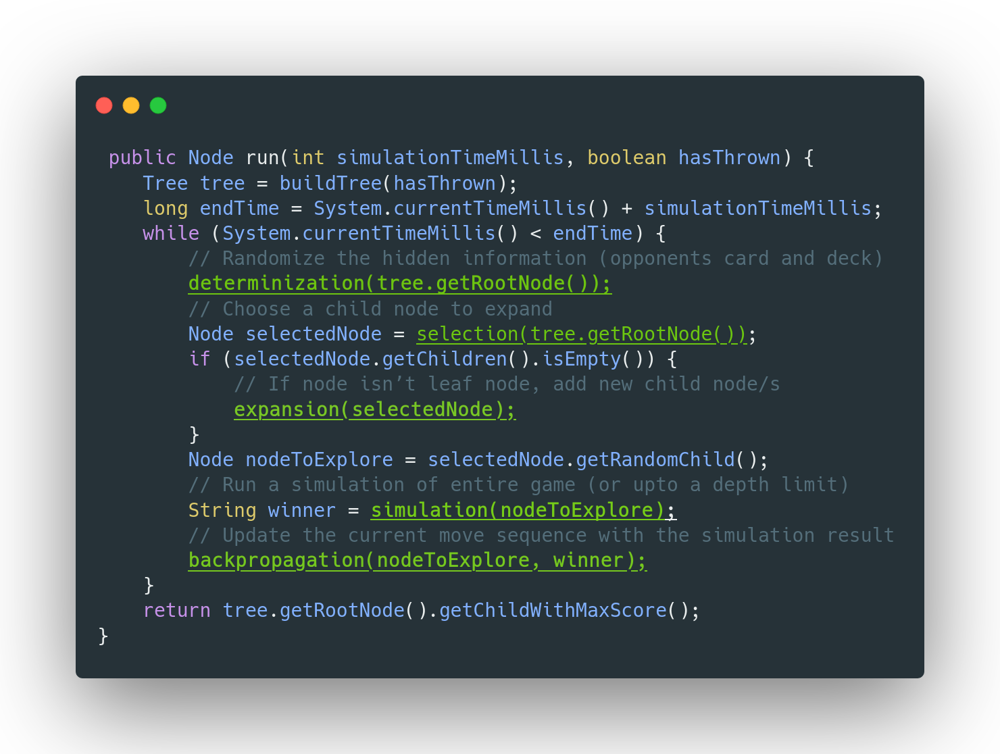

# Dhumbal API

## Description
A backend service for a Nepali card game.

## Tech Stack
- Java (Spring Boot)
- MySQL: persistent data
- Redis: game state cache
- React: 

## Setup
1. Clone the repo
2. Run `docker-compose up` from the docker folder
3. Check and update the env from `src/main/resources/application.yaml`
4. Then run `./mvnw spring-boot:run`
5. Access the API on `localhost:8080`

## Features
- Online turn-based multiplayer game
- Real-time gameplay using WebSocket
- Game state saved in cache for faster performance
- AI Agent with multiple difficulty levels
- Global leaderboard with real-time ranking

## Architecture
### DFD

### Schema Diagram

### Overall Flowchart

### Overall Flowchart

### Pseudocode of Agent Algorithm

## Author

